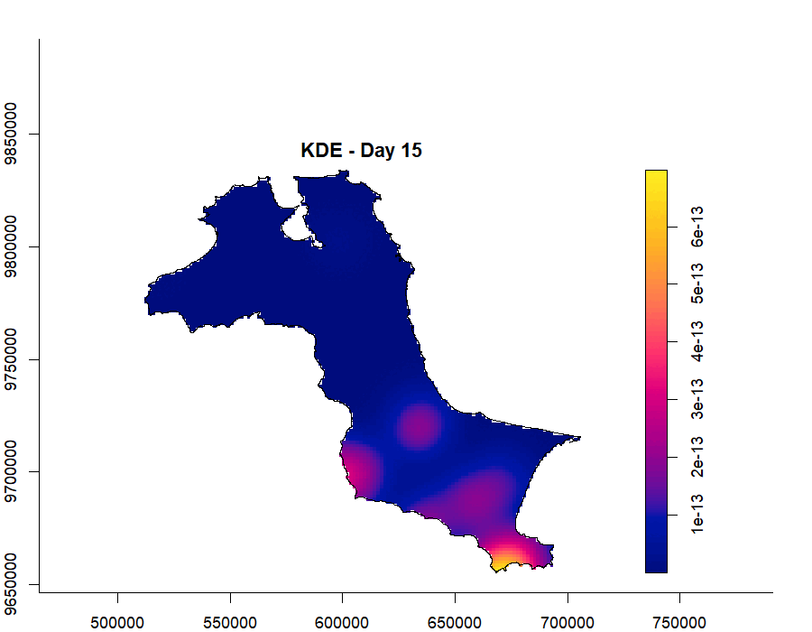

::: {.exercise-lead}
This exercise examines forest fire events recorded in Kepulauan Bangka Belitung during 2023. I map the events over time, estimate their changing density, and check whether they cluster across both space and time.
:::

::: {.callout-note title="A few changes from the tutorial 🙂"}
I follow [Chapter 6](https://r4gdsa.netlify.app/chap06), with a few small changes to explore the results:

- **Six selected days** make the daily maps easier to compare.
- **A short GIF** helps me follow how the pattern changes over the year.
- **The final K-function plot** shows observed minus expected values, so the difference is easier to see.
:::

## 1. What I am looking at

A spatio-temporal point pattern records both where and when events happen. Here, each point is a forest fire detected by the MODIS sensor. I want to see whether the fire locations are spread evenly or whether they form concentrations that change over the year.

Two datasets are used:

- `forestfires.csv`, containing the locations and dates of 741 detected fire events; and
- `Kepulauan_Bangka_Belitung`, containing the administrative boundaries of the study area.

## 2. Loading the R packages

```{r}
pacman::p_load(sf, spatstat, sparr, 
               tmap, stpp, tidyverse,
               animation)
```

## 3. Preparing the study area

### 3.1 Importing the boundary

First, I import the original boundary layer.

```{r}
kbb <- st_read(dsn="chap06/data/rawdata",
               layer = "Kepulauan_Bangka_Belitung") 
```

The revised code combines the individual administrative areas into one study boundary, removes any extra Z or M coordinates, and changes the coordinate system to UTM Zone 48S. A projected coordinate system is needed because the following analysis uses distance.

```{r}
kbb_sf <- st_read(dsn="chap06/data/rawdata",
               layer = "Kepulauan_Bangka_Belitung") %>%
  st_union() %>%
  st_zm(drop = TRUE, what = "ZM") %>%
  st_transform(crs = 32748)
```

### 3.2 Creating the observation window

`as.owin()` changes the study boundary into the window format used by `spatstat`.

```{r}
kbb_owin <- as.owin(kbb_sf)
kbb_owin
```

The class check confirms that the conversion worked.

```{r}
class(kbb_owin)
```

## 4. Preparing the forest fire data

The CSV is imported, converted from longitude and latitude into an `sf` point layer, and projected to the same coordinate system as the study area.

```{r}
fire_sf <- read_csv("chap06/data/rawdata/forestfires.csv") %>%
  st_as_sf(coords = c("longitude", "latitude"),
                       crs = 4326) %>%
  st_transform(crs = 32748)
```

I then create three simple time fields: day of year, month number, and month name. The month fields are used to compare the fire pattern over the year.

```{r}
fire_sf <- fire_sf %>% 
  mutate(DayofYear = yday(acq_date)) %>%
  mutate(Month_num = month(acq_date)) %>%
  mutate(Month_fac = month(acq_date, 
                           label = TRUE, 
                           abbr = FALSE))
```

## 5. Visualising the fire points

### 5.1 Overall distribution

I first map all recorded fire locations together.

```{r}
tm_shape(kbb_sf)+
  tm_polygons() +
tm_shape(fire_sf) +
  tm_dots()
```

I run the completed map using the same code.

```{r}
tm_shape(kbb_sf)+
  tm_polygons() +
tm_shape(fire_sf) +
  tm_dots()
```

The point map shows where fires were detected during the whole year, but it does not show whether the pattern changed over time.

### 5.2 Distribution by month

Next, I separate the fire events into monthly panels.

```{r}
tm_shape(kbb_sf)+
  tm_polygons() +
tm_shape(fire_sf) +
  tm_dots(size = 0.1) +
tm_facets(by="Month_fac", 
            free.coords=FALSE, 
            drop.units = TRUE)
```

I run the completed monthly map using the same code.

```{r}
tm_shape(kbb_sf)+
  tm_polygons() +
tm_shape(fire_sf) +
  tm_dots(size = 0.1) +
tm_facets(by="Month_fac", 
            free.coords=FALSE, 
            drop.units = TRUE)
```

The monthly panels make the change much clearer. There are relatively few detections from January to June, activity rises from July, and the largest numbers occur from August to October. October has the most events, with 185 detections.

## 6. Computing space-time KDE by month

Kernel density estimation turns the points into a smooth surface. Adding month as the time value lets me compare how the areas of higher fire activity shift during the year.

### 6.1 Keeping the monthly mark

Only the month number and geometry are needed to create the point pattern object.

```{r}
fire_month <- fire_sf %>% 
  select(Month_num)
```

### 6.2 Creating the point pattern

```{r}
fire_month_ppp <- as.ppp(fire_month)
fire_month_ppp
```

The summary shows the number of points, their spatial window, and the range of month values.

```{r}
summary(fire_month_ppp)
```

I also check whether any fire records share the same coordinates.

```{r}
any(duplicated(fire_month_ppp))
```

### 6.3 Adding the study window

The boundary is applied so that the analysis is limited to Kepulauan Bangka Belitung.

```{r}
fire_month_owin <- fire_month_ppp[kbb_owin]
summary(fire_month_owin)
```

Plotting the result is a quick check that the points and boundary line up correctly.

```{r}
plot(fire_month_owin)
```

### 6.4 Estimating monthly density

`spattemp.density()` estimates one smooth space-time density object from the point locations and their month values.

```{r}
st_kde <- spattemp.density(fire_month_owin)
summary(st_kde)
```

### 6.5 Comparing July to December

I plot the monthly density from July to December using the same colour range, so the panels can be compared directly.

```{r}
#| fig-width: 12
#| fig-height: 10
tims <- c(7,8,9,10,11,12)
par(mfcol=c(2,3))
for(i in tims){ 
  plot(st_kde, i, 
       override.par=FALSE, 
       fix.range=TRUE, 
       main=paste("KDE at month",i))
}
```

The density surfaces help distinguish a real concentration from a pile of overlapping dots. In July and August, the stronger concentration is mainly in the west and north. It then shifts towards the south and east from September to November, with the widest and strongest surface in October. By December, the density falls sharply.

## 7. Computing space-time KDE by day of year

Using the day of year gives a more detailed view than grouping everything into months. Each event is now marked with a number from 1 to 365.

### 7.1 Creating the point pattern

```{r}
fire_yday_ppp <- fire_sf %>%
  select(DayofYear) %>%
  as.ppp()
```

I apply the same study boundary and check the result.

```{r}
fire_yday_owin <- fire_yday_ppp[kbb_owin]
summary(fire_yday_owin)
```

The 741 fire events run from day 10 to day 352. Most occur later in the year, which agrees with the monthly maps.

### 7.2 Estimating daily density

```{r}
kde_yday <- spattemp.density(
  fire_yday_owin)
summary(kde_yday)
```

The automatic estimate uses a spatial bandwidth of about 15 kilometres and a temporal bandwidth of about 6 days. This gives a detailed view of short-term changes, although neighbouring days can look quite different.

Plotting all 343 daily surfaces would make the page difficult to read, so I compare six dates spread across the year.

```{r}
#| fig-width: 12
#| fig-height: 10
days_to_plot <- c(30, 120, 210, 240, 270, 330)
par(mfcol = c(2, 3))
for (day in days_to_plot) {
  plot(kde_yday, tselect = day,
       override.par = FALSE,
       fix.range = TRUE,
       main = paste("KDE at day", day))
}
```

The early-year surfaces remain weak because there are few recorded fires. Activity becomes much clearer after day 210, with concentrations shifting across the province rather than staying in one place.

## 8. Improving the bandwidths

The bandwidth controls how much nearby events are blended together. A very small value produces a patchy surface, while a very large value can hide local differences. `BOOT.spattemp()` searches for a more balanced pair of spatial and temporal bandwidths.

```{r}
set.seed(1234)
BOOT.spattemp(fire_yday_owin)
```

The selected values are about 9,106 metres and 18.9 days. Rounding them to 9,000 metres and 19 days keeps the next step simple.

### 8.1 Recomputing the daily density

```{r}
kde_yday <- spattemp.density(fire_yday_owin,
                             h = 9000,
                             lambda = 19)
summary(kde_yday)
```

Compared with the automatic estimate, this version uses a smaller area around each fire but a longer time window. In simple terms, it keeps more local spatial detail while reducing sudden jumps from one day to the next.

```{r}
#| fig-width: 12
#| fig-height: 10
par(mfcol = c(2, 3))
for (day in days_to_plot) {
  plot(kde_yday, tselect = day,
       override.par = FALSE,
       fix.range = TRUE,
       main = paste("Improved KDE at day", day))
}
```

The main seasonal story stays the same, but the later surfaces are easier to follow. The concentrations build through the middle of the year, become strongest around August to October, and then weaken towards December.

### 8.2 Animating the daily pattern

I use one frame every 30 days so the movement is clear without producing hundreds of nearly identical images.

```{r}
#| results: hide
animation_days <- seq(15, 345, by = 30)
frame_dir <- tempfile("kde_frames_")
dir.create(frame_dir)

for (i in seq_along(animation_days)) {
  png(file.path(frame_dir, sprintf("frame_%02d.png", i)),
      width = 900, height = 700, res = 110)
  plot(kde_yday, tselect = animation_days[i],
       main = paste("KDE - Day", animation_days[i]))
  dev.off()
}

frames <- magick::image_read(
  list.files(frame_dir, pattern = "png$", full.names = TRUE)
)
kde_animation <- magick::image_animate(frames, fps = 2)
magick::image_write(kde_animation,
                    path = "chap06/kde_animation.gif")
unlink(frame_dir, recursive = TRUE)
```

{fig-alt="Animated space-time kernel density surfaces showing the forest fire pattern changing across Kepulauan Bangka Belitung during 2023."}

## 9. Checking clustering across space and time

The density maps show where activity is stronger. I now use a space-time K-function to check whether pairs of fires occur closer together than expected under spatial and temporal independence.

### 9.1 Creating the space-time point object

First, I extract the projected coordinates.

```{r}
coords <- st_coordinates(fire_sf)
```

I combine the coordinates with the day of year.

```{r}
fire_df <- data.frame(
  x = coords[, 1],
  y = coords[, 2],
  t = fire_sf$`DayofYear`)
```

The data frame is then converted to the format used by `stpp`.

```{r}
fire_stpp <- as.3dpoints(fire_df)
```

```{r}
class(fire_stpp)
```

The 3D plot uses the two horizontal axes for location and the vertical axis for day of year.

```{r}
plot(fire_stpp)
```

The left panel shows the spatial pattern. On the right, the cumulative line rises slowly early in the year and much faster after about day 200, confirming that most detections occurred later in 2023.

### 9.2 Computing the space-time K-function

```{r}
kbb_stik <- STIKhat(fire_stpp)
```

To make the result easier to interpret, I subtract the value expected under independence from the observed K-function. Positive values mean there are more nearby event pairs than expected.

```{r}
k_difference <- kbb_stik$Khat - kbb_stik$Ktheo

filled.contour(
  x = kbb_stik$dist / 1000,
  y = kbb_stik$times,
  z = k_difference,
  color.palette = hcl.colors,
  xlab = "Spatial distance (km)",
  ylab = "Time difference (days)",
  main = "Observed K-function minus expected value"
)
```

The difference is positive across the distances and time gaps shown, from about 2.9 to 43.5 kilometres and 6 to 87 days. This means the data contain more nearby fire pairs than an independent pattern would produce. Together with the density maps, it supports the view that the fires are clustered in both place and time.

This is still a descriptive comparison rather than a formal significance test. Simulation envelopes would be needed before making a stronger statistical claim.

## 10. Discussion

The monthly and daily views tell a consistent story. Fire activity is limited early in 2023, begins to rise around July, and is strongest from August to October. The main concentration also moves: it is more visible in the west and north during July and August, before becoming stronger in the south and east from September to November.

The improved daily KDE makes that change easier to follow because it smooths over about 19 days while retaining more local spatial detail. The K-function comparison points in the same direction, showing more nearby fire pairs than expected under independence. The analysis can show when and where concentrations appear, but it does not identify their cause; weather, land cover, land management, and detection conditions would need separate data.

[← Back to hands-on exercises](hands-on-exercise.qmd){.back-link}
