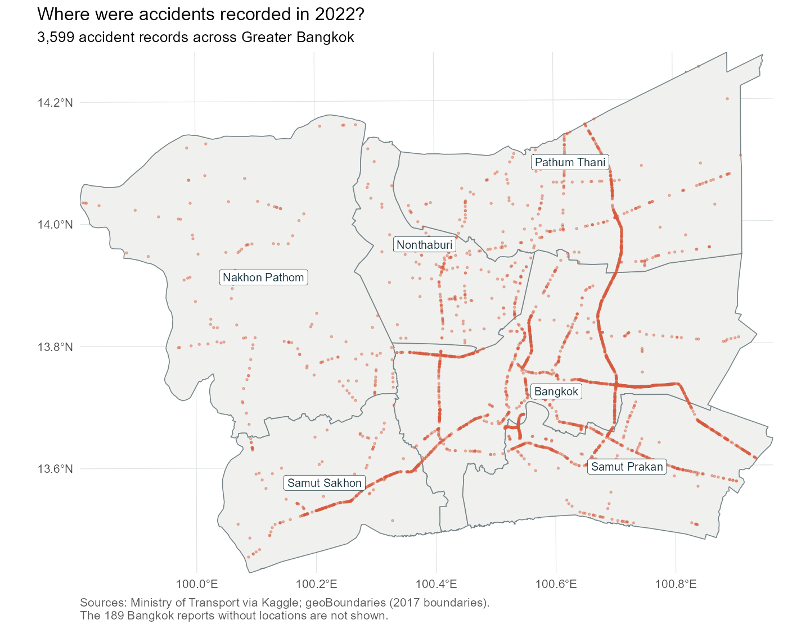
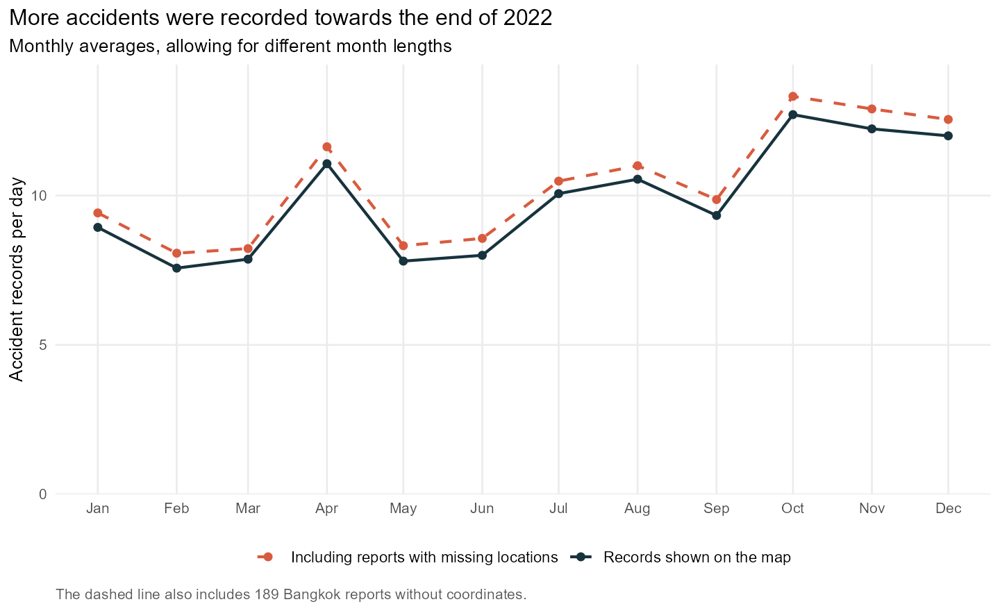
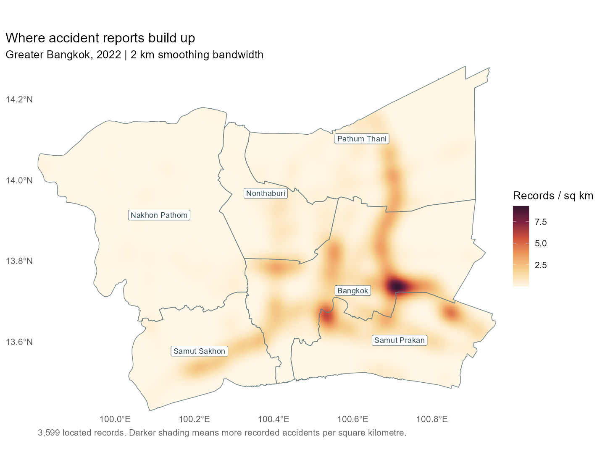
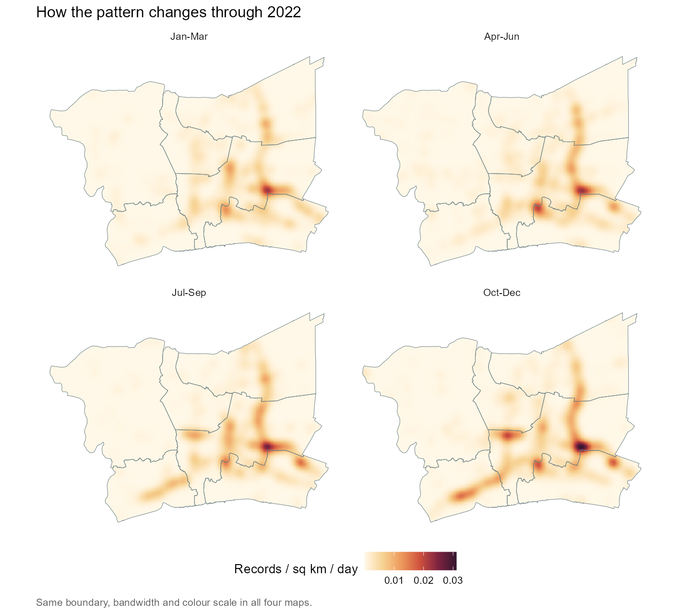
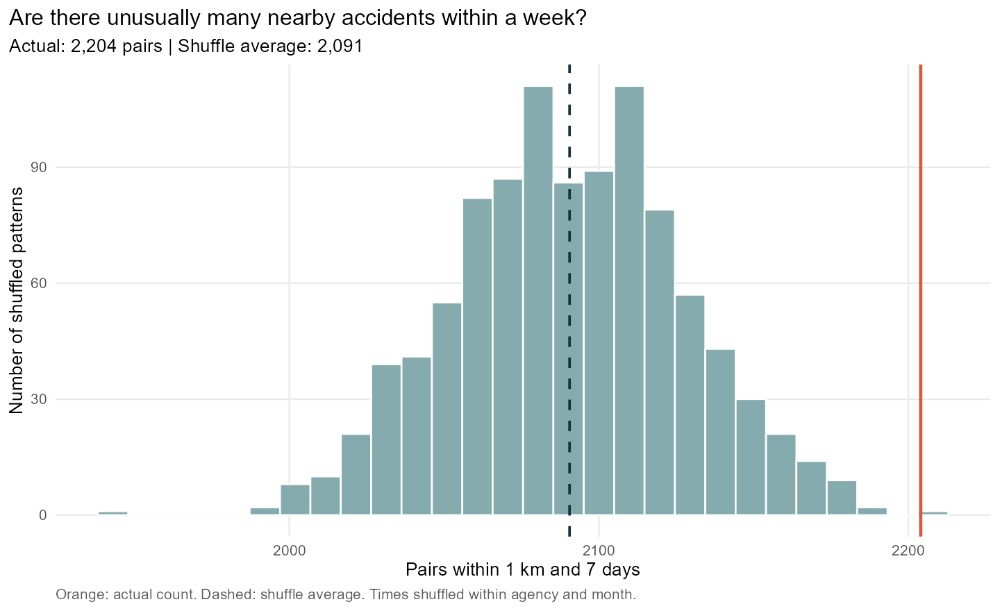

::: {.exercise-lead}
I use the 2022 road accident records to look at where accidents were reported in Greater Bangkok, how this changed over the year, and whether nearby accidents often happened within days of each other.
:::

[View the short presentation](take-home-exercise-01-summary.qmd)

## 1. What I want to find out

I chose Greater Bangkok so I could look at the city and its surrounding provinces together. The 2022 data cover a full year, which makes it possible to compare the months.

There are four questions I want to explore:

- Where were most accidents recorded?
- Which months had more accidents?
- Did nearby accidents happen close together in time more often than expected?
- Could missing locations change what the maps and charts show?

I check the records before making the maps. Then I look for places with many reports and test whether nearby accidents happened close together in time. To judge how dangerous a road is, I would also need to know how much traffic it carries.

## 2. The data

| Data | What I use it for |
|---|---|
| [Thailand Road Accident 2019–2022](https://www.kaggle.com/datasets/thaweewatboy/thailand-road-accident-2019-2022) | Accident locations and dates. I use only 2022. Each row is an accident report; it does not count a single vehicle or casualty. |
| [Thailand provincial boundaries](https://www.geoboundaries.org/api/current/gbOpen/THA/ADM1/) | Defining the study area and placing accidents within its provinces. These boundaries represent 2017. |

Both datasets were downloaded on 11 September 2026. The accident data come from a compilation of Ministry of Transport records covering **highways, rural roads and expressways**. They do not cover every accident on every local street. [Source: Ministry of Transport](https://datagov.mot.go.th/dataset/roadaccident).

Here, Greater Bangkok means **Bangkok, Nonthaburi, Pathum Thani, Nakhon Pathom, Samut Prakan and Samut Sakhon**, following the National Statistical Office's [Bangkok and Vicinities grouping](https://www.nso.go.th/public/e-book/Statistical-Yearbook/SYB-2025/110/).

The study runs from 1 January to 31 December 2022, using the date of the accident. A report submitted later still belongs to the day the accident happened. I treat the times as local Thai time, although the source does not state the time zone.

I combine the six provinces into one study area, so the analysis can cross their internal borders. WGS 84 / UTM zone 47N (EPSG:32647) lets me measure distances in metres. These are straight-line distances, so two nearby points may still be on different roads or opposite sides of a river.

```{r}
#| label: th01-packages
#| include: false
library(sf)
library(tidyverse)
library(spatstat.geom)
library(digest)

theme_set(theme_minimal(base_size = 12))
theme_update(panel.grid.minor = element_blank(),
             plot.title.position = "plot",
             plot.caption = element_text(hjust = 0, colour = "grey35"))
ink <- "#17333d"
accent <- "#d85b3f"

raw_dir <- "data/take-home-01/raw"
derived_dir <- "data/take-home-01/derived"
dir.create(derived_dir, recursive = TRUE, showWarnings = FALSE)
dir.create("take-home-01/figures", recursive = TRUE, showWarnings = FALSE)

manifest <- read_csv("take-home-01/source-manifest.csv", show_col_types = FALSE)
stopifnot(all(vapply(file.path(raw_dir, manifest$filename), function(path) {
  digest(path, algo = "sha256", file = TRUE)
}, character(1)) == manifest$sha256))
```

```{r}
#| label: th01-import
#| include: false
raw <- read_csv(
  file.path(raw_dir, "thai_road_accident_2019_2022.csv"),
  col_types = cols(
    .default = col_character(),
    latitude = col_double(), longitude = col_double(),
    number_of_vehicles_involved = col_double(),
    number_of_fatalities = col_double(), number_of_injuries = col_double()
  )
)
stopifnot(nrow(problems(raw)) == 0L)
exact_duplicates <- sum(duplicated(raw))

records <- raw %>%
  distinct() %>%
  mutate(
    source_row = match(acc_code, raw$acc_code),
    incident_time = ymd_hms(incident_datetime, tz = "Asia/Bangkok", quiet = TRUE),
    report_time = ymd_hms(report_datetime, tz = "Asia/Bangkok", quiet = TRUE)
  )
stopifnot(!anyNA(records$acc_code), anyDuplicated(records$acc_code) == 0L)

window_start <- ymd_hms("2022-01-01 00:00:00", tz = "Asia/Bangkok")
window_end <- ymd_hms("2023-01-01 00:00:00", tz = "Asia/Bangkok")

records_2022 <- records %>%
  filter(incident_time >= window_start, incident_time < window_end) %>%
  mutate(coord_status = case_when(
    is.na(latitude) | is.na(longitude) ~ "Missing coordinate",
    !between(latitude, -90, 90) | !between(longitude, -180, 180) ~ "Invalid range",
    latitude == 0 & longitude == 0 ~ "Zero coordinate pair",
    TRUE ~ "Usable"
  ))

tibble(
  Check = c("Downloaded rows", "Exact duplicate rows", "Unparsed incident times",
            "Earliest incident in the full file", "Latest incident in the full file",
            "Records in 2022"),
  Result = c(nrow(raw), exact_duplicates, sum(is.na(records$incident_time)),
             format(min(records$incident_time, na.rm = TRUE)),
             format(max(records$incident_time, na.rm = TRUE)), nrow(records_2022))
) %>% knitr::kable()
```

```{r}
#| label: th01-study-window
#| include: false
region_names <- c("Bangkok", "Nonthaburi", "Pathum Thani",
                  "Nakhon Pathom", "Samut Prakan", "Samut Sakhon")

boundaries <- st_read(file.path(raw_dir, "geoBoundaries-THA-ADM1.geojson"),
                      quiet = TRUE)
provinces <- boundaries %>%
  mutate(province_geom = str_remove(shapeName, " Province$")) %>%
  filter(province_geom %in% region_names) %>%
  st_transform(32647)

stopifnot(nrow(provinces) == 6L, setequal(provinces$province_geom, region_names))
invalid_boundary_count <- sum(!st_is_valid(provinces))
provinces <- st_make_valid(provinces)
study_window <- st_union(provinces)
stopifnot(all(st_is_valid(provinces)), !any(st_is_empty(provinces)))

tibble(
  Check = c("Selected provinces", "Invalid geometries before repair",
            "Area of downloaded study window (square kilometres)", "Projected CRS"),
  Result = c(nrow(provinces), invalid_boundary_count,
             round(as.numeric(st_area(study_window)) / 1e6, 1),
             st_crs(study_window)$input)
) %>% knitr::kable()
```

```{r}
#| label: th01-spatial-filter
#| include: false
located <- records_2022 %>%
  filter(coord_status == "Usable") %>%
  st_as_sf(coords = c("longitude", "latitude"), crs = 4326, remove = FALSE) %>%
  st_transform(32647)

province_matches <- st_intersects(located, provinces)
located$province_matches <- lengths(province_matches)
located$province_geom <- vapply(province_matches, function(i) {
  if (length(i) == 1L) provinces$province_geom[i] else NA_character_
}, character(1))
located$inside_window <- lengths(st_intersects(located, study_window)) > 0L

accidents <- located %>%
  filter(inside_window) %>%
  mutate(
    incident_date = as.Date(incident_time, tz = "Asia/Bangkok"),
    month_start = floor_date(incident_date, "month"),
    hour = hour(incident_time),
    province_label_disagrees = is.na(province_geom) | province_en != province_geom
  ) %>%
  group_by(longitude, latitude, incident_time) %>%
  mutate(same_location_time_n = n()) %>%
  ungroup()

unlocated_region <- records_2022 %>%
  filter(coord_status != "Usable", province_en %in% region_names)

audit <- tibble(
  Step = c("Downloaded national file", "Remove exact duplicate rows",
           "Exclude missing or unparsed incident times", "Keep incidents in 2022",
           "Exclude unusable coordinates", "Keep locations inside the six-province window"),
  Removed = c(NA, exact_duplicates, sum(is.na(records$incident_time)),
              sum(!is.na(records$incident_time)) - nrow(records_2022),
              sum(records_2022$coord_status != "Usable"),
              sum(!located$inside_window)),
  Remaining = c(nrow(raw), nrow(records), sum(!is.na(records$incident_time)),
                nrow(records_2022), nrow(located), nrow(accidents))
)
audit %>% knitr::kable(format.args = list(big.mark = ","))
```

```{r}
#| label: th01-location-checks
#| include: false
location_checks <- tibble(
  Check = c("Missing coordinates in 2022, nationally",
            "Out-of-range or zero-pair coordinates in 2022",
            "Unlocated records labelled within the six-province region",
            "Located outside the window but labelled within the region",
            "Located inside the window but labelled outside the region",
            "Retained records whose province label disagrees with the geometry",
            "Retained records matching multiple provinces",
            "Records beyond the first at a shared coordinate",
            "Records belonging to a same-location, same-time group"),
  Records = c(sum(records_2022$coord_status == "Missing coordinate"),
              sum(records_2022$coord_status %in% c("Invalid range", "Zero coordinate pair")),
              nrow(unlocated_region),
              sum(!located$inside_window & located$province_en %in% region_names),
              sum(!accidents$province_en %in% region_names),
              sum(accidents$province_label_disagrees),
              sum(accidents$province_matches > 1),
              sum(duplicated(st_coordinates(accidents))),
              sum(accidents$same_location_time_n > 1))
)
location_checks %>% knitr::kable()
```

## 3. Checking the records

First, I kept the 2022 records. I then checked their dates and locations, removed records that could not be placed on a map, and kept those inside the six provinces.

```{r}
#| label: th01-record-summary
tibble(
  Records = c("All years in the downloaded file", "From 2022",
              "From 2022, with usable locations", "Inside Greater Bangkok"),
  Number = c(nrow(raw), nrow(records_2022), nrow(located), nrow(accidents))
) %>% knitr::kable(format.args = list(big.mark = ","))
```

This leaves **`r format(nrow(accidents), big.mark = ",")` accident records** for the map. All the dates could be read, and there were no completely duplicated records. No coordinates were outside the valid latitude/longitude ranges or recorded as (0, 0). I also checked the boundary shapes for invalid or empty geometry before using them to select the points.

### 3.1 Missing locations

There are **189 records without coordinates**. All are listed as accidents in Bangkok. I checked which agency reported them to see whether the missing locations were spread across the data.

```{r}
#| label: th01-missingness
missingness <- records_2022 %>%
  filter(province_en == "Bangkok") %>%
  count(agency, usable = coord_status == "Usable") %>%
  pivot_wider(names_from = usable, values_from = n, values_fill = 0,
              names_prefix = "usable_") %>%
  mutate(total = usable_TRUE + usable_FALSE,
         missing_pct = 100 * usable_FALSE / total,
         agency_label = recode(agency,
           "department of highways" = "Department of Highways",
           "department of rural roads" = "Department of Rural Roads",
           "expressway authority of thailand" = "Expressway Authority"))

ggplot(missingness, aes(x = missing_pct, y = reorder(agency_label, missing_pct))) +
  geom_col(fill = accent, width = 0.55) +
  geom_text(aes(label = paste0(usable_FALSE, " / ", total)),
            hjust = -0.15, size = 3.7, colour = ink) +
  scale_x_continuous(limits = c(0, 55), breaks = seq(0, 50, 10),
                     labels = function(x) paste0(x, "%")) +
  labs(title = "Some Bangkok reports have no recorded location",
       subtitle = "Bangkok, 2022 | Labels show missing locations / total reports",
       x = "Reports with missing locations", y = NULL,
       caption = "Source: Ministry of Transport compilation via Kaggle, version 1.")
```

All 189 came from the Expressway Authority. They make up **43.1% of its 439 Bangkok reports**, compared with no missing locations in the other two agencies' Bangkok records. This means the map leaves out a substantial part of the Expressway Authority's reports. I keep these records for the monthly comparison because their dates are still available, but cannot place them on the map.

### 3.2 Repeated or conflicting locations

There are 321 records at coordinates already used by another record. Several accidents can happen at the same place, so I keep them. Two pairs have both the same location and the same accident time, but different record numbers. I cannot tell whether these are duplicate reports. I keep them in the main analysis and later check whether removing them changes the result.

A few records have coordinates that disagree with their province names. I use their plotted locations to decide whether they belong in the study area. This excludes four records listed under the six provinces and includes ten listed elsewhere. The boundary data are older than the accident records, so I cannot assume every disagreement is a recording error.

## 4. Where were accidents recorded?

Each dot is an accident record. Records at the same location overlap, so one visible dot can represent several accidents.

```{r}
#| label: th01-location-map
#| fig-height: 7
#| fig-alt: "Map of six Greater Bangkok provinces with 3,599 recorded accident locations in 2022, showing linear concentrations and uneven spatial coverage."
province_labels <- st_point_on_surface(provinces)

location_plot <- ggplot() +
  geom_sf(data = provinces, fill = "#f0f1ee", colour = "#778489", linewidth = 0.35) +
  geom_sf(data = accidents, colour = accent, size = 0.55, alpha = 0.4) +
  geom_sf_label(data = province_labels, aes(label = province_geom),
                size = 3.2, colour = ink, fill = "white", linewidth = 0.15) +
  coord_sf(crs = st_crs(32647), datum = st_crs(4326), expand = FALSE) +
  labs(title = "Where were accidents recorded in 2022?",
       subtitle = "3,599 accident records across Greater Bangkok",
       x = NULL, y = NULL,
       caption = paste("Sources: Ministry of Transport via Kaggle; geoBoundaries (2017 boundaries).",
                       "The 189 Bangkok reports without locations are not shown.",
                       sep = "\n")) +
  theme(panel.grid.major = element_line(colour = "#dce1e2", linewidth = 0.25))
ggsave("take-home-01/figures/locations.png", plot = location_plot, width = 9, height = 7, dpi = 160)

```

The dots follow several long routes through Bangkok and towards the surrounding provinces. This fits the dataset's focus on highways, rural roads and expressways. Bangkok has the largest number of mapped records, followed by Samut Prakan. Areas with fewer dots should not automatically be seen as safer: some roads may be outside this reporting system, and we do not know how much traffic each road carries.

```{r}
#| label: th01-province-counts
province_counts <- accidents %>%
  st_drop_geometry() %>%
  count(province_geom, name = "located_records", sort = TRUE) %>%
  mutate(share_pct = round(100 * located_records / sum(located_records), 1))

province_counts %>%
  rename(Province = province_geom, `Accident records` = located_records,
         `Share (%)` = share_pct) %>%
  knitr::kable()
```

Bangkok accounts for **1,802 records**, about half of those on the map. Samut Prakan follows with **671**. These counts use the recorded coordinates to assign each accident to a province.

## 5. When were more accidents recorded?

Longer months have more days for accidents to occur. To make the comparison fairer, I divide each month's total by its number of days.

The solid line uses the records shown on the map. The dashed line adds the 189 reports with missing locations. Their province names place them in Bangkok, although I cannot check their exact positions.

```{r}
#| label: th01-monthly-summary
#| include: false
month_calendar <- tibble(month_start = seq(as.Date("2022-01-01"),
                                          as.Date("2022-12-01"), by = "month"))

monthly <- accidents %>%
  st_drop_geometry() %>%
  count(month_start, name = "located_n") %>%
  right_join(month_calendar, by = "month_start") %>%
  left_join(
    unlocated_region %>%
      mutate(month_start = as.Date(floor_date(incident_time, "month"),
                                   tz = "Asia/Bangkok")) %>%
      count(month_start, name = "unlocated_n"),
    by = "month_start"
  ) %>%
  mutate(
    across(c(located_n, unlocated_n), ~ replace_na(.x, 0L)),
    days = days_in_month(month_start),
    located_per_day = located_n / days,
    including_unlocated_per_day = (located_n + unlocated_n) / days
  ) %>%
  arrange(month_start)

stopifnot(sum(monthly$located_n) == nrow(accidents),
          sum(monthly$unlocated_n) == nrow(unlocated_region), sum(monthly$days) == 365)

monthly %>%
  transmute(Month = month.abb[month(month_start)],
            `Located records` = located_n,
            `Unlocated Bangkok reports` = unlocated_n,
            `Located records per day` = round(located_per_day, 2)) %>%
  knitr::kable()
```

```{r}
#| label: th01-monthly-pattern
#| fig-alt: "Monthly accident records per day. Both the mapped records and the comparison including reports with missing locations peak in October."
monthly_long <- monthly %>%
  select(month_start, located_per_day, including_unlocated_per_day) %>%
  pivot_longer(-month_start, names_to = "sample", values_to = "records_per_day") %>%
  mutate(sample = recode(sample,
    located_per_day = "Records shown on the map",
    including_unlocated_per_day = "Including reports with missing locations"))

monthly_plot <- ggplot(monthly_long, aes(x = month_start, y = records_per_day,
                         colour = sample, linetype = sample)) +
  geom_line(linewidth = 0.9) +
  geom_point(size = 2) +
  scale_colour_manual(values = c("Including reports with missing locations" = accent,
                                 "Records shown on the map" = ink)) +
  scale_linetype_manual(values = c("Including reports with missing locations" = "dashed",
                                   "Records shown on the map" = "solid")) +
  scale_x_date(breaks = monthly$month_start,
               labels = month.abb[month(monthly$month_start)]) +
  scale_y_continuous(limits = c(0, NA), expand = expansion(mult = c(0, 0.08))) +
  labs(title = "More accidents were recorded towards the end of 2022",
       subtitle = "Monthly averages, allowing for different month lengths",
       x = NULL, y = "Accident records per day", colour = NULL, linetype = NULL,
       caption = "The dashed line also includes 189 Bangkok reports without coordinates.") +
  theme(legend.position = "bottom", legend.text = element_text(size = 10))
ggsave("take-home-01/figures/monthly.png", plot = monthly_plot, width = 9, height = 5.5, dpi = 160)

```

**October has the highest count: 394 mapped records, or about 12.7 per day.** November has fewer records than December, but more per day because it is a shorter month. April also stands out compared with March and May.

Adding the reports with missing locations raises the figures slightly but leaves the same broad pattern: more accidents were recorded towards the end of the year. The location gaps therefore do not explain that increase on their own. The chart does not tell us whether changes in traffic, road conditions or reporting caused it.

```{r}
#| label: th01-save-objects
#| include: false
study_owin <- as.owin(study_window)
xy <- st_coordinates(accidents)
accident_ppp <- ppp(xy[, 1], xy[, 2], window = study_owin,
                    marks = accidents$acc_code, unitname = c("metre", "metres"))

stopifnot(npoints(accident_ppp) == nrow(accidents),
          all(st_is_valid(accidents)), !any(st_is_empty(accidents)),
          all(accidents$incident_time >= window_start & accidents$incident_time < window_end),
          nrow(located) == nrow(accidents) + sum(!located$inside_window))

saveRDS(accidents, file.path(derived_dir, "accidents_2022_bmr.rds"))
saveRDS(provinces, file.path(derived_dir, "bmr_provinces.rds"))
saveRDS(study_window, file.path(derived_dir, "bmr_window.rds"))
saveRDS(accident_ppp, file.path(derived_dir, "accidents_2022_bmr_ppp.rds"))
write_csv(unlocated_region, file.path(derived_dir, "unlocated_region_2022.csv"))
write_csv(audit, file.path(derived_dir, "sample_audit.csv"))
write_csv(location_checks, file.path(derived_dir, "location_checks.csv"))
write_csv(monthly, file.path(derived_dir, "monthly_summary.csv"))
write_csv(accidents %>% st_drop_geometry() %>% filter(province_label_disagrees),
          file.path(derived_dir, "province_disagreements.csv"))
write_csv(accidents %>% st_drop_geometry() %>% filter(same_location_time_n > 1),
          file.path(derived_dir, "possible_duplicate_reports.csv"))
```

```{r}
#| label: th01-complete-analysis
#| include: false
source("scripts/analyse-take-home-01.R", local = TRUE)
fmt_n <- function(x) format(round(x), big.mark = ",", trim = TRUE)
fmt_p <- function(x) formatC(x, format = "f", digits = 3)
density_colours <- c("#fff8e8", "#f6d292", "#ed995c", "#cf513d", "#7e2340", "#35162f")
```

## 6. Where do the main concentrations appear?

Overlapping dots make it hard to see where there are more reports. Kernel density estimation (KDE) smooths them into a map, with darker areas where reports are more concentrated. This is the first-order part of the analysis: looking at how the number of events varies from place to place.

I use a Gaussian kernel with a 2 km bandwidth. This spreads each accident's contribution around its location, fading with distance. The bandwidth controls how much the map is smoothed. I chose 2 km to look at broad areas and also try 1 km and 4 km to see how much the choice matters.

The map is divided into 250 m cells. Near the outer boundary, I correct for the part of the smoothing that would fall outside the study area. Accidents outside the boundary are still missing from the data. Smoothing also spreads colour over land between roads, so this map shows the broad density of reports per square kilometre. It cannot identify the risk on an individual road section. [Method: spatstat KDE documentation](https://search.r-project.org/CRAN/refmans/spatstat.explore/html/density.ppp.html).

```{r}
#| label: th01-density-map
#| fig-height: 7
#| fig-alt: "Smoothed density of recorded accidents across the six Greater Bangkok provinces, using a two kilometre bandwidth."
density_plot <- ggplot(filter(kde_annual, bandwidth == "2 km"), aes(x, y, fill = density)) +
  geom_raster() +
  geom_sf(data = provinces, inherit.aes = FALSE, fill = NA,
          colour = "#697c80", linewidth = 0.3) +
  geom_sf_label(data = province_labels, aes(label = province_geom), inherit.aes = FALSE,
                size = 3, fill = "white", colour = ink, linewidth = 0.15) +
  scale_fill_gradientn(colours = density_colours, name = "Records / sq km") +
  coord_sf(crs = st_crs(32647), datum = st_crs(4326), expand = FALSE) +
  labs(title = "Where accident reports build up",
       subtitle = "Greater Bangkok, 2022 | 2 km smoothing bandwidth",
       x = NULL, y = NULL,
       caption = "3,599 located records. Darker shading means more recorded accidents per square kilometre.") +
  theme(panel.grid.major = element_blank())
ggsave("take-home-01/figures/density.png", plot = density_plot, width = 9, height = 7, dpi = 160)

```

Eastern Bangkok has the darkest patch, near 100.714°E, 13.733°N. The estimated density there is about 9.3 records per km² over the year. Other patches extend into the surrounding provinces. I would use these areas to decide where to look more closely, then check the original records to find the roads and junctions involved. Differences in traffic and reporting coverage may explain some of the shading. The missing expressway locations also leave gaps.

### 6.1 Does the smoothing choice change the picture?

```{r}
#| label: th01-bandwidth-check
#| fig-height: 4.6
#| fig-alt: "Three density maps using one, two and four kilometre bandwidths with the same colour scale."
ggplot(kde_annual, aes(x, y, fill = density)) +
  geom_raster() +
  geom_sf(data = provinces, inherit.aes = FALSE, fill = NA, colour = "#697c80", linewidth = 0.2) +
  facet_wrap(~bandwidth, nrow = 1) +
  scale_fill_gradientn(colours = density_colours, name = "Records / sq km") +
  coord_sf(crs = st_crs(32647), datum = NA) +
  labs(title = "The same records, with different amounts of smoothing",
       x = NULL, y = NULL,
       caption = "One shared colour scale. Wider smoothing spreads the peaks over more land.") +
  theme(panel.grid.major = element_blank(), legend.position = "bottom")
```

Eastern Bangkok stands out in all three maps. With more smoothing, the peak drops from 21.7 to 9.3 to 4.0 records per km², and nearby patches merge. The broad location stays similar, but its outline and peak value depend on the bandwidth. I would be cautious about drawing a precise hotspot boundary from any one of these maps. Whether the pattern is statistically unusual needs a separate test.

## 7. Did the concentrations move during the year?

The monthly chart showed more reports late in the year. Did those extra reports come from the same places? I split the year into four quarters to make the maps easier to compare than twelve monthly maps. All four use a 2 km bandwidth and the same colour scale.

Each map is adjusted for the number of days in its quarter: 90, 91, 92 and 92. The colours show records per square kilometre per day, allowing for those small differences in length.

```{r}
#| label: th01-quarter-maps
#| fig-height: 8
#| fig-alt: "Four quarterly accident density maps, adjusted for quarter length and shown on a common colour scale."
quarter_plot <- ggplot(kde_quarterly, aes(x, y, fill = density)) +
  geom_raster() +
  geom_sf(data = provinces, inherit.aes = FALSE, fill = NA, colour = "#697c80", linewidth = 0.2) +
  facet_wrap(~quarter, ncol = 2) +
  scale_fill_gradientn(colours = density_colours, name = "Records / sq km / day") +
  coord_sf(crs = st_crs(32647), datum = NA) +
  labs(title = "How the pattern changes through 2022", x = NULL, y = NULL,
       caption = "Same boundary, bandwidth and colour scale in all four maps.") +
  theme(panel.grid.major = element_blank(), legend.position = "bottom")
ggsave("take-home-01/figures/quarters.png", plot = quarter_plot, width = 9, height = 8, dpi = 160)

```

Bangkok and Samut Sakhon show clear increases. Bangkok averaged 3.94 reports per day in the first quarter (January to March) and 6.17 in the last (October to December). Samut Sakhon rises from 0.39 to 1.67 per day. Pathum Thani changes much less, from 1.27 to 1.41. The maps show where these changes appear within each province. I would need more years to tell whether this happens regularly, and other data to explain the increase.

## 8. Do nearby accidents also happen close together in time?

A busy route may have accidents spread throughout the year. I wanted to check whether nearby accidents also tended to happen within a few days of each other. This is the second-order part of the analysis, which looks at pairs of events.

I use a Knox-style test to count pairs of accidents within 1 km and no more than 7 days apart. I chose these limits before seeing the results, as a way to check nearby accidents over one week. They are choices for this exercise, not official safety limits. Each pair counts once, although one accident can appear in several pairs. [Method: Knox test documentation](https://search.r-project.org/CRAN/refmans/surveillance/html/knox.html).

### 8.1 What am I comparing against?

I keep the locations in place and shuffle the accident times, then count the close pairs again. Times are only swapped among records from the same agency in the same calendar month. Repeating this 999 times gives me a range of counts to compare with the actual count.

This keeps each agency's road coverage and the monthly number of reports at each location. The dates and times available within each group also stay the same; only their assignment to locations changes. Busy dates and months therefore remain busy in the shuffled data.

The assumption is that swapping times within these groups gives a fair comparison when nearby accidents have no extra tendency to happen close together in time. Local traffic schedules, roadworks or reporting changes could make that assumption wrong.

I measure distance in a straight line and time from the recorded timestamps, so 7 days means 168 hours. I test for more close pairs, which makes this a one-sided test. The comparison uses only the observed locations and times within the six provinces in 2022. I do not estimate missing neighbours beyond those edges. The result applies to these records and still leaves out the 189 reports without coordinates. Finding no extra pairs would not establish that accidents are spatially random or that roads are safe.

```{r}
#| label: th01-pair-test
#| fig-alt: "Histogram of close-pair counts after shuffling times, with the actual observed count marked for comparison."
primary_column <- which(pair_test$results$radius_m == 1000 & pair_test$results$lag_days == 7)
pair_plot <- ggplot(tibble(pairs = pair_test$simulations[, primary_column]), aes(pairs)) +
  geom_histogram(bins = 28, fill = "#85abae", colour = "white") +
  geom_vline(xintercept = primary$expected, colour = ink, linetype = "dashed", linewidth = 0.8) +
  geom_vline(xintercept = primary$observed, colour = accent, linewidth = 1) +
  expand_limits(x = primary$observed) +
  labs(title = "Are there unusually many nearby accidents within a week?",
       subtitle = paste0("Actual: ", fmt_n(primary$observed),
                         " pairs | Shuffle average: ", fmt_n(primary$expected)),
       x = "Pairs within 1 km and 7 days", y = "Number of shuffled patterns",
       caption = "Orange: actual count. Dashed: shuffle average. Times shuffled within agency and month.")
ggsave("take-home-01/figures/pair-test.png", plot = pair_plot, width = 9, height = 5.5, dpi = 160)

```

The actual count is `r fmt_n(primary$observed)` pairs. The shuffled records average `r fmt_n(primary$expected)`, so the actual count is `r sprintf("%.1f", primary$excess_pct)`% higher. The middle 95% of shuffled counts falls between `r fmt_n(primary$lower)` and `r fmt_n(primary$upper)`. The actual count is above that range, with a one-sided p-value of `r fmt_p(primary$p_upper)`. Nearby accidents happened within a week slightly more often than this comparison suggests. The test accounts for each agency's monthly pattern, but it cannot show that one accident caused another or that the result applies to every location.

The p-value describes how unusual the actual count is in this comparison. I count the shuffled patterns with at least as many close pairs, add the observed pattern, and divide by 1,000. The smallest possible p-value with 999 shuffles is 0.001.

### 8.2 Does the answer depend on choosing 1 km and 7 days?

I try 0.5, 1 and 2 km, each with time limits of 3, 7 and 14 days. That gives nine combinations, using the same shuffled records. This checks whether the result changes when I look a little closer, farther away, or over a different number of days.

```{r}
#| label: th01-scale-check
#| fig-height: 4.5
#| fig-alt: "Nine combinations of distance and time thresholds, showing the percentage difference between observed close pairs and the shuffle average."
scale_results <- pair_test$results %>%
  mutate(radius = factor(paste(radius_m / 1000, "km"), levels = c("0.5 km", "1 km", "2 km")),
         period = factor(paste(lag_days, "days"), levels = c("3 days", "7 days", "14 days")),
         label = sprintf("%+.1f%%", excess_pct))
ggplot(scale_results, aes(period, radius, fill = excess_pct)) +
  geom_tile(colour = "white", linewidth = 2) +
  geom_text(aes(label = label), colour = ink, size = 5) +
  scale_fill_gradient2(low = "#86b8c2", mid = "#f6f2e9", high = "#eb9871",
                       midpoint = 0, limits = c(-1, 1) * max(abs(scale_results$excess_pct)),
                       name = "Difference (%)") +
  labs(title = "Checking nearby distances and time windows",
       subtitle = "Difference from the shuffle average; positive values mean more close pairs",
       x = "Time apart", y = "Distance apart") +
  theme(panel.grid = element_blank())
```

The actual count is above the shuffled average in all nine comparisons. The difference is largest at 0.5 km and 3 days, at 17.1%, and smallest at 2 km and 14 days, at 2.7%. The shorter periods show larger percentage differences. After adjusting for the nine comparisons, eight have p-values below 0.05. The exception is 0.5 km and 7 days, at 0.055, so the evidence is weaker at that setting.

Trying more settings also gives more chances to find an unusual result. For an overall check, I measure each difference relative to how much the shuffled counts vary, then take the largest one. I do the same for every shuffle. This accounts for checking all nine settings and gives an overall p-value of `r fmt_p(pair_test$global_p)`.

### 8.3 Could repeated locations or reporting differences explain it?

I return to the 1 km / 7 day comparison and check three alternatives: remove one record from each possible duplicate pair; leave out pairs at exactly the same coordinates; and shuffle within month without separating agencies.

```{r}
#| label: th01-robustness-table
robustness %>%
  transmute(Check = check, `Observed pairs` = observed,
            `Shuffle average` = round(expected),
            `Difference (%)` = round(excess_pct, 1),
            `p-value` = fmt_p(p_upper)) %>%
  knitr::kable(format.args = list(big.mark = ","))
```

The actual count stays about 5 to 6% above the shuffled average. Removing the possible duplicates leaves a difference of 5.3%; leaving out pairs at identical coordinates gives 4.9%. Those records do not explain the result on their own. Shuffling without separating agencies gives a slightly larger difference, so I keep agencies separate in the main test. Errors in coordinates or changes in local traffic and reporting during a month could still affect the result.

## 9. What do these results say together?

Eastern Bangkok stands out on the density maps even when I change the amount of smoothing. The quarterly maps show that the later increase varies by province, with clear rises in Bangkok and Samut Sakhon. The pair test adds another finding: there are 5.4% more pairs within 1 km and 7 days than the shuffled comparison suggests. Removing possible duplicates and pairs at repeated locations gives similar results.

The maps show where reports build up, while the test suggests that nearby accidents also happen close together in time more often than expected under this comparison. I cannot tell from the regional test whether the eastern Bangkok peak is responsible. That would need a separate test of individual areas.

The data leave several questions open. The three agencies cover selected roads, and the spatial analysis leaves out the 189 Bangkok expressway reports without coordinates. Without traffic volumes or road lengths, I cannot compare the chance of an accident per journey. Shared or inaccurate coordinates may make accidents appear closer than they were, and straight-line distances ignore the road connections.

These results cover only 2022. More years would help show whether the late-year rise recurs. Traffic changes, weather, roadworks and reporting practices could all help explain the patterns, but this analysis cannot tell which mattered or identify a particular dangerous junction.

## 10. What would I do with this information?

I would start by checking the original reports around eastern Bangkok, since that area stands out at all three bandwidths. Matching each accident to the right carriageway and junction would help identify repeated locations. Crash type, severity and road conditions would then help decide what changes to consider. The density map gives me a place to start, but cannot tell me which road treatment would work.

The late-year rises in Bangkok and Samut Sakhon also deserve a closer look. Agency records could show whether workload changed during those months. Traffic counts, roadworks and changes in reporting would help explain whether there were more accidents or more complete reporting. I would check other years before planning a campaign for a particular season.

The pair test gives a reason to review recent nearby accidents together, perhaps weekly. Before using this to trigger an alert or move staff, I would test the rule on later data and check how often it produces false alarms. This exercise has not evaluated an alert system.

I would also try to recover the coordinates for the 189 Bangkok expressway reports and repeat the analysis. They are a large gap in the records available for mapping.

Choosing roads for intervention or locations for emergency services would need traffic volumes, crash severity and service travel times alongside these results. The current analysis helps decide what to investigate next; it does not measure risk per journey or establish which intervention will work.

## 11. Sources and methods

- [Thailand Road Accident 2019–2022](https://www.kaggle.com/datasets/thaweewatboy/thailand-road-accident-2019-2022), version 1; [Ministry of Transport source](https://datagov.mot.go.th/dataset/roadaccident). Only 2022 is analysed.
- [geoBoundaries Thailand ADM1](https://www.geoboundaries.org/api/current/gbOpen/THA/ADM1/), 2017 boundary representation, pinned to release commit 9469f09. Derived from OpenStreetMap/Wambacher; Open Database License 1.0.
- [National Statistical Office: Bangkok and Vicinities](https://www.nso.go.th/public/e-book/Statistical-Yearbook/SYB-2025/110/), for the six-province grouping.
- [spatstat: kernel-smoothed intensity](https://search.r-project.org/CRAN/refmans/spatstat.explore/html/density.ppp.html), for the density maps and edge correction.
- [Knox test for space-time interaction](https://search.r-project.org/CRAN/refmans/surveillance/html/knox.html), for the close-pair approach. Here I adapt the shuffling to preserve agency-month groups and compare several distance/time settings together.

[Presentation](take-home-exercise-01-summary.qmd) · [Project and analysis source](https://github.com/chinh02/isss626-chinh-le)

[← Back to take-home exercises](take-home-exercise.qmd){.back-link}
