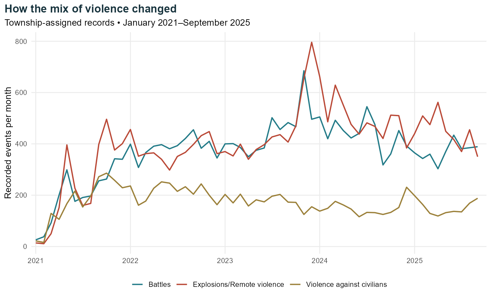
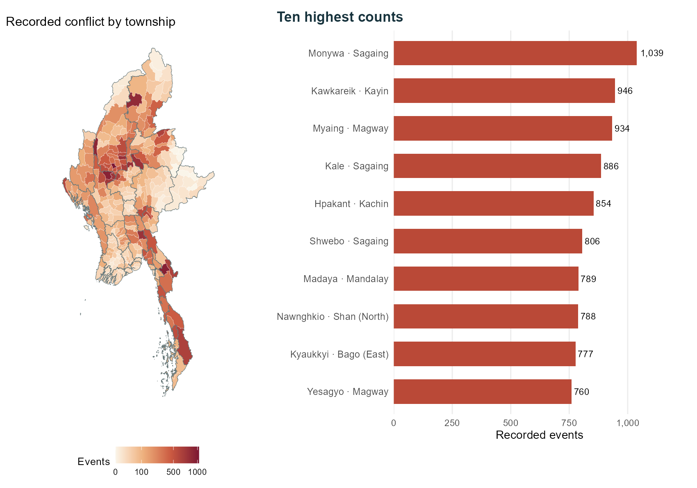
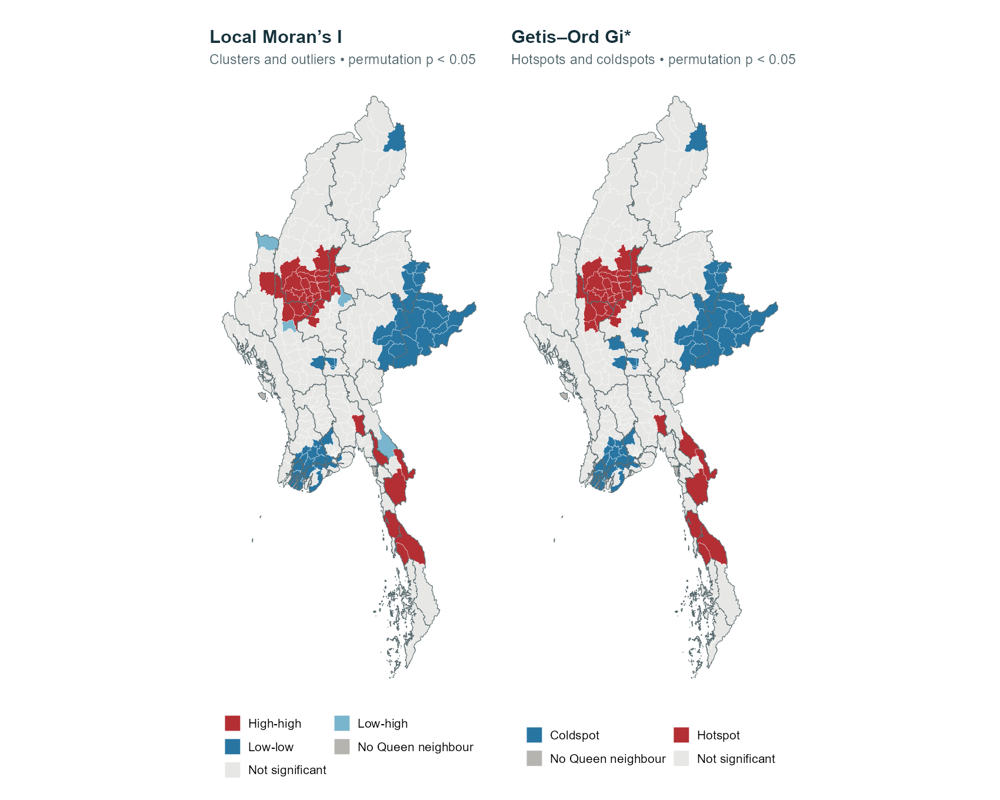
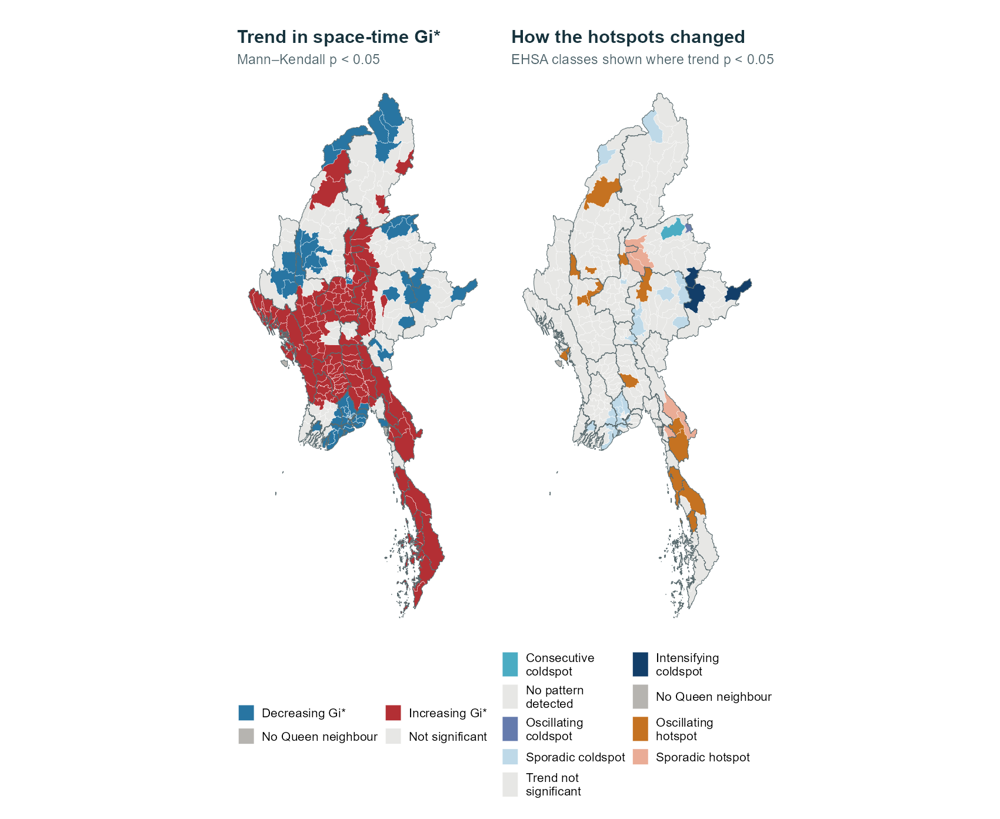
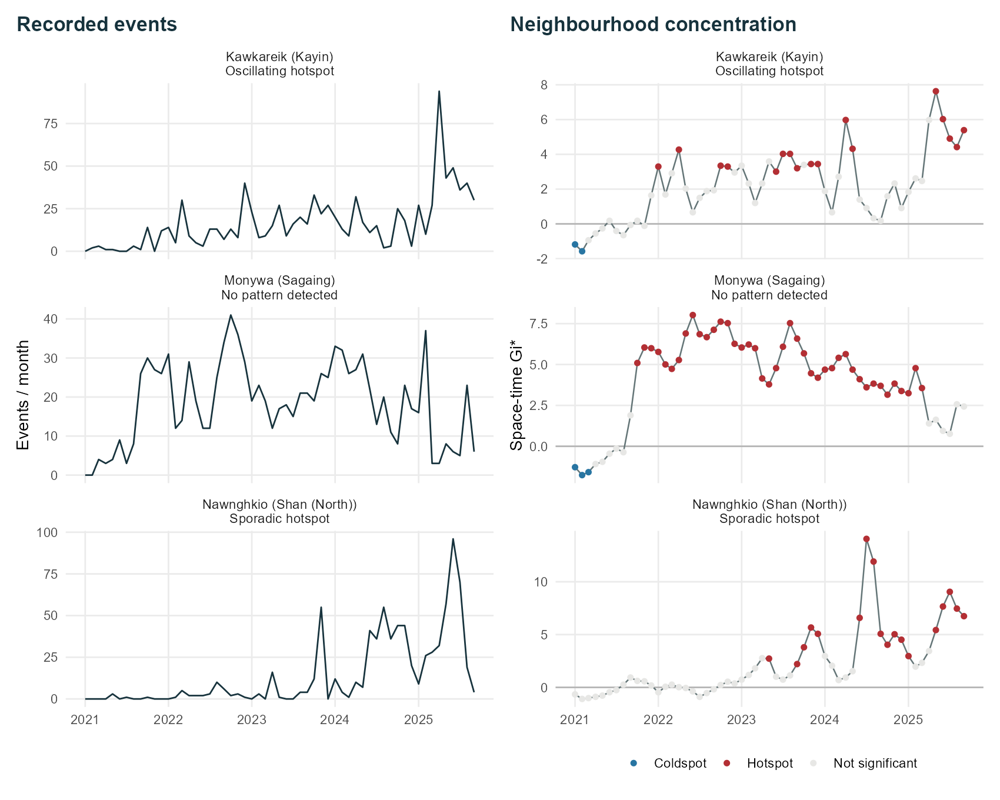
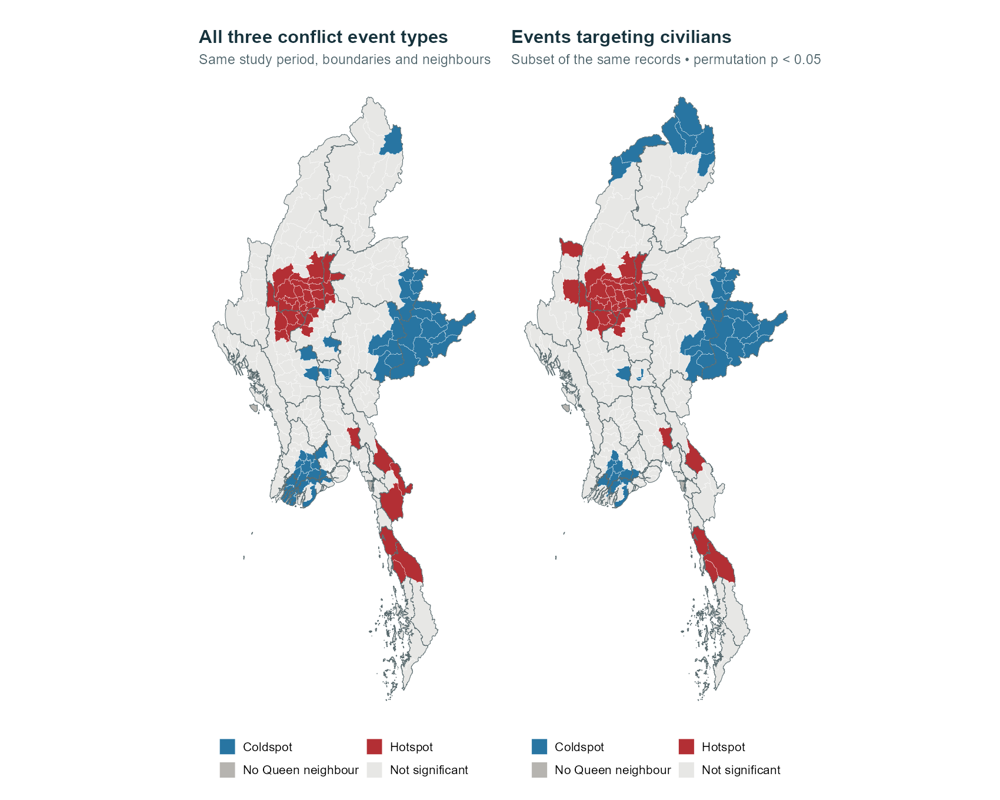

```{r}
#| label: th02-results
#| include: false
knitr::read_chunk("scripts/analyse-take-home-02.R")
knitr::read_chunk("scripts/visualise-take-home-02.R")
if (.Platform$OS.type == "windows") invisible(Sys.setlocale("LC_CTYPE", "English_United States.utf8"))
result_path <- "data/take-home-02/derived/analysis.rds"
inputs <- c("scripts/analyse-take-home-02.R",
            "data/take-home-02/raw/aspatial/ACLED_Data_Myanmar_Jan2021-Sep2025.csv",
            "data/take-home-02/raw/geospatial/mmr_polbnda_adm3_250k_mimu_1.shp")
if (!file.exists(result_path) || any(file.info(inputs)$mtime > file.info(result_path)$mtime)) {
  source("scripts/analyse-take-home-02.R", local = new.env(), encoding = "UTF-8")
}
source("scripts/visualise-take-home-02.R", local = new.env(), encoding = "UTF-8")
library(tidyverse)
library(sf)
a <- readRDS(result_path)
town_results <- a$towns %>% st_drop_geometry() %>% left_join(a$local, by = "TS_PCODE") %>%
  left_join(a$ehsa, by = "TS_PCODE")
cases <- read_csv("data/take-home-02/derived/case-townships.csv", show_col_types = FALSE)
fmt <- function(x) format(round(x), big.mark = ",", scientific = FALSE, trim = TRUE)
pct <- function(x) paste0(round(100*x, 1), "%")
hot <- a$local$gi_cluster == "Hotspot"
civ_hot <- a$civilian$gi_cluster == "Hotspot"
valid <- !is.na(a$local$gi_p)
```

::: {.exercise-lead}
Conflict can fall nationally while rising in individual townships. I follow Myanmar’s conflict records from January 2021 to September 2025 to see where events concentrated, how those places changed, and where civilians were targeted.
:::

[View the executive summary](take-home-exercise-02-summary.qmd)

## National trends and local differences {#study-questions}

The national total fell by **12.4%** between January–September 2024 and the same months of 2025. Yet Kawkareik and Nawnghkio each recorded more events in the first nine months of 2025 than in all of 2024.

Monywa has the highest total over the study period. I compare these histories, then look at civilian targeting to identify places where aid groups could check for unmet needs.

### Questions for this study

I work through three questions:

- Which townships form clusters of high recorded conflict, and which stand out from their neighbours?
- Where have hotspots appeared, continued or weakened over the study period?
- Does the pattern change when I focus on events targeting civilians?

The [ACLED background reading](https://acleddata.com/report/between-cooperation-and-competition-struggle-resistance-groups-myanmar) describes how relationships between armed groups vary across regions. I focus on where the events were recorded and how that changed.

## Data and coverage {#data-and-study-area}

### Sources and study period

| Source | What I use |
|---|---|
| [ACLED Myanmar data](https://acleddata.com/country/myanmar), supplied through the course’s eLearn page | Event dates, types, named townships, locations, civilian-targeting flags and reported fatalities. |
| [MIMU township boundaries v9.4](https://geonode.themimu.info/layers/geonode:mmr_polbnda_adm3_250k_mimu_1) | The 330 township boundaries and their township codes. |

The supplied file contains 87,109 records and covers all 57 months of the assignment, from January 2021 to September 2025.

The packages below handle the data, maps and spatial tests.

```{r}
#| label: th02-packages
#| eval: false
```

I read the event records and township boundaries, then check dates, IDs and geometry.

```{r}
#| label: th02-settings
#| eval: false
```

```{r}
#| label: th02-import
#| eval: false
```


### Which events are included?


```{r}
#| label: th02-filter
#| eval: false
```

I exclude six “Indian Ocean” records, protests and strategic developments. The study keeps **battles, explosions/remote violence, and violence against civilians**.

Of the 54,000 qualifying records, 107 have no named township and 88 have only a broad location. Removing them leaves **`r fmt(a$validation$retained)` events**, with no duplicate IDs.


```{r}
#| label: th02-coordinates
#| eval: false
```

I match each township with its state or region, allowing for spelling and punctuation differences, including “Pangsang (Panghkam)”. This avoids assigning city-wide reports to a city-centre point. For `r a$validation$coordinate_disagreements` records, the coordinates fall outside the named township. I keep the named township and log these cases without changing the raw data.

::: {.callout-note title="What the counts mean"}
Reporting coverage varies, so event counts cannot measure risk per person or capture all violence. ACLED flags events where civilians were the main or only target; other incidents may also harm civilians. [ACLED codebook](https://acleddata.com/methodology/acled-codebook)
:::

### Keeping months with no recorded events {#preparing-the-monthly-data}


```{r}
#| label: th02-cube
#| eval: false
```

Each township gets one row per month: **330 × 57 = 18,810 rows**. Months without a qualifying event keep a zero count. They make up `r pct(a$validation$zero_event_bins/a$validation$bins)` of the rows, so dropping them would leave out much of the quieter period.

The analysis uses the same boundary version throughout. The monthly comparison also avoids treating the nine months of 2025 as a full year.

## Where and when conflict was recorded

### The monthly total peaked in late 2023 {#changes-over-time}


```{r}
#| label: th02-descriptive-counts
#| eval: false
```

```{r}
#| label: th02-plot-style
#| eval: false
```

```{r}
#| label: th02-monthly-plot
#| eval: false
```



The highest monthly total is **November 2023, with 1,465 events**, followed by December with 1,447. Counts remain high into early 2024. Explosions and remote violence account for the largest category in both 2024 and the available months of 2025.

January–September 2025 has **8,728 events**, compared with **9,961** in the same months of 2024: a **12.4% decline**. Some townships still saw increases, as the later timelines show.

### Sagaing accounts for nearly a quarter of events {#where-conflict-is-concentrated}


```{r}
#| label: th02-distribution-plot
#| eval: false
```



Sagaing accounts for **12,612 events**, or `r pct(12612/a$validation$retained)` of the records. Magway follows with 5,384 and Mandalay with 4,911, placing much of the recorded conflict in central Myanmar.

**`r town_results$TS[which.max(town_results$events)]`** has the highest township count, with **`r fmt(max(town_results$events))` events**. Local Moran’s I and Gi* will show whether high counts also cluster across neighbouring townships. Differences in size, population and reporting coverage limit comparisons of personal risk.

### Follow a township through the months {#explore-the-months}


```{r}
#| label: th02-explorer-code
#| eval: false
```

Try Kawkareik or Nawnghkio, then compare their later rise with Monywa’s longer history of high counts. The colour scale stays fixed as the month changes, so the same colour always represents the same range of counts.

```{=html}
<iframe src="take-home-02/conflict-explorer.html" title="Explore Myanmar conflict counts by month and township" style="width:100%;height:850px;border:1px solid #dce3df;border-radius:8px" loading="lazy"></iframe>
```

[Open the explorer in its own tab](take-home-02/conflict-explorer.html)

## Where conflict forms clusters {#clusters-outliers-and-hotspots}

Local Moran’s I distinguishes clusters from townships that stand out from their neighbours. Gi* identifies concentrations of high or low counts across a neighbourhood.

### What counts as a neighbour?


```{r}
#| label: th02-neighbours
#| eval: false
```

I start with **Queen contiguity**: townships are neighbours if their boundaries touch at an edge or corner. Each township’s neighbour weights sum to one. Local Moran’s I compares the township with those neighbours; Gi* also includes the township itself.

Chaungzon, Munaung and Cocokyun have no shared-boundary neighbours in this layer. Their counts remain in the study, but I leave them unclassified in the Queen-based tests. I use an Albers projection centred on Myanmar for mapping and distance checks, with a one-metre tolerance when identifying shared boundaries.


```{r}
#| label: th02-local-tests
#| eval: false
```

Both tests use 999 conditional permutations: counts are shuffled among other townships while the focal count stays fixed. The maps show **two-sided permutation p < 0.05**; grey areas are not significant.

### Most hotspots are in central Myanmar


```{r}
#| label: th02-local-run
#| eval: false
```

```{r}
#| label: th02-map-helper
#| eval: false
```

```{r}
#| label: th02-local-plot
#| eval: false
```



Local Moran’s I identifies **38 high–high townships, 52 low–low townships and four low–high outliers**. The outliers are Hlaingbwe, Tonzang, Seikphyu and Pyinoolwin: their own counts are below the township average, but their neighbours’ weighted counts are above it. No high–low outlier passes the significance threshold. Gi* identifies **38 hotspots and 53 coldspots**.

**Sagaing has 18 Gi* hotspots, Mandalay seven and Magway six.** Both methods point to central Myanmar, though their different tests give slightly different low-count classifications.

Kawkareik ranks second with **946 events**, yet its whole-period Gi* result is not significant. Its monthly history tells a different story.

```{r}
#| label: th02-local-counts
bind_rows(a$local %>% count(lisa, name = "Townships") %>% rename(Result = lisa) %>% mutate(Method = "Local Moran’s I"),
          a$local %>% count(gi_cluster, name = "Townships") %>% rename(Result = gi_cluster) %>% mutate(Method = "Gi*")) %>%
  select(Method, Result, Townships) %>% knitr::kable()
```

### Which hotspots survive stricter checks? {#how-much-do-the-choices-matter}


```{r}
#| label: th02-neighbour-checks
#| eval: false
```

I repeat Gi* with a symmetric six-nearest-centroid neighbourhood and with only the more precisely located records. I also apply the Benjamini–Hochberg adjustment because testing many townships can produce chance discoveries.

```{r}
#| label: th02-sensitivity
tibble(Check = c("Queen neighbours", "Queen neighbours, multiple-test adjustment", "Six nearest neighbours", "Queen neighbours, precise locations only"),
       Hotspots = c(sum(hot), sum(hot & a$local$gi_q < .05, na.rm = TRUE),
                    sum(a$comparison$knn6[valid] == "Hotspot"), sum(a$comparison$precise_only == "Hotspot")),
       Coldspots = c(sum(a$local$gi_cluster == "Coldspot"), sum(a$local$gi_cluster == "Coldspot" & a$local$gi_q < .05, na.rm = TRUE),
                     sum(a$comparison$knn6[valid] == "Coldspot"), sum(a$comparison$precise_only == "Coldspot"))) %>% knitr::kable()
```

The multiple-test adjustment reduces the hotspot count from **38 to 19**. I therefore treat the wider unadjusted hotspot map as exploratory. Across the 327 townships with Queen neighbours, the hotspot/coldspot/non-significant classifications agree in **87.2%** of cases with six-nearest neighbours and **91.7%** when only more precise locations are retained.

The broad pattern holds, though individual labels change and six-nearest neighbours produces more coldspots. I keep shared boundaries for the main analysis.

## How local patterns changed {#how-the-hotspots-changed}

Similar totals can hide different histories: repeated conflict early in the study or a later surge. Monthly results show when each place became a hotspot.

### Following hotspots through time


```{r}
#| label: th02-time-neighbours
#| eval: false
```

```{r}
#| label: th02-time-gi
#| eval: false
```

Emerging Hot Spot Analysis (EHSA) uses each township and its Queen neighbours in the current and previous month. January 2021 uses January alone. Gi* compares these counts with the distribution across the whole space–time cube.


```{r}
#| label: th02-mann-kendall
#| eval: false
```

The **Mann–Kendall test** checks whether each township’s Gi* scores tend to rise or fall. It tracks the neighbourhood concentration; the event timelines show the township’s own counts.


```{r}
#| label: th02-classification-rules
#| eval: false
```

EHSA then combines that trend with the months classified as hot or cold. A new hotspot appears at the end for the first time; a consecutive hotspot has an uninterrupted final run; a sporadic hotspot appears on and off. Persistent, intensifying and diminishing hotspots require at least 90% of months to be hot. I use the same rules with the signs reversed for coldspots. [Classification definitions](https://doc.esri.com/en/arcgis-pro/latest/tool-reference/space-time-pattern-mining/learnmoreemerging.html)

### Hotspots came and went


```{r}
#| label: th02-classify
#| eval: false
```

```{r}
#| label: th02-ehsa-plot
#| eval: false
```



The full classification finds **26 oscillating hotspots and eight sporadic hotspots**. Of these, **16 and seven**, respectively, also have significant Mann–Kendall trends and appear on the map. No township meets the new, consecutive, persistent or intensifying hotspot rules in this run.

“Oscillating” has a specific meaning here: the township ends as a hotspot but has previously been a significant coldspot. It does not necessarily mean a regular cycle. “Sporadic” describes an on-and-off hotspot that ends hot and has no significant cold months.

The September 2025 endpoint affects the labels. Earlier hot months can still end in “No pattern detected” if the final-month rules are not met, as Monywa shows below.

Following the handout, the map shows **Mann–Kendall p < 0.05**. The table also includes classifications without a significant trend, which this filter hides.

```{r}
#| label: th02-ehsa-counts
a$ehsa %>% group_by(classification) %>%
  summarise(`All townships` = n(), `Trend p < 0.05` = sum(trend_p < .05, na.rm = TRUE), .groups = "drop") %>%
  rename(Pattern = classification) %>% knitr::kable()
```

### Three townships, three different histories {#a-closer-look-at-contrasting-townships}

I take the highest-count township from each of the two hotspot classes with significant trends, plus Monywa for its largest overall total.


```{r}
#| label: th02-stories-plot
#| eval: false
```



**Kawkareik, Kayin — oscillating hotspot.** Its history includes two cold months in 2021 and several later hot periods. By September 2025, it has recorded **356 events for the year**, already above the **168 in all of 2024**. The upward Gi* trend also survives the block-resampling check. Its whole-period map misses this later concentration.

**Nawnghkio, Shan (North) — sporadic hotspot.** The records grow from five events in 2021 to 310 in 2024 and 341 by September 2025. It has 18 hot months across the study and no significant cold months. September itself has only four events, yet remains a hotspot: Gi* includes neighbouring townships and the preceding month, so it is describing a wider concentration.

**Monywa, Sagaing — no EHSA pattern at the endpoint.** Monywa is hot throughout 2022–2024, but only three of the nine months in 2025. September’s permutation p-value is 0.066, and the overall Mann–Kendall trend is also not significant. It combines the largest historical total, **1,039 events**, with a September result that does not meet the hotspot rule.

Aid assessments could follow the recent increases in Kawkareik and Nawnghkio while checking continuing needs in Monywa.

### Do the trends hold up? {#checking-the-trend-results}

```{r}
#| label: th02-block-function
#| eval: false
```

```{r}
#| label: th02-block-run
#| eval: false
```

Nearby months are related, especially because Gi* includes the preceding month. I check the trend results with 999 resamples of six-month blocks after removing the estimated trend, then adjust for testing many townships.

The ordinary test identifies **`r sum(a$ehsa$trend_p < .05, na.rm = TRUE)` significant trends**. This falls to **`r sum(a$ehsa$block_p < .05, na.rm = TRUE)`** with the block check, and **`r sum(a$ehsa$block_q < .05, na.rm = TRUE)`** after also adjusting those block-test p-values across townships. The median correlation between successive Gi* scores is **`r round(median(a$ehsa$lag1, na.rm = TRUE), 2)`**, so treating the months as independent would overstate the evidence.

Kawkareik and Nawnghkio retain evidence of upward trends. Yesagyo does not: its p-value rises from about 0.006 to `r round(town_results$block_p[town_results$TS == 'Yesagyo'], 3)` in the block check, weakening the evidence for a sustained rise.

Adjusting the monthly hotspot tests and township trend tests also changes **`r sum(a$ehsa$classification != a$ehsa$classification_fdr)` EHSA classifications**. These labels depend on the significance settings, the neighbour definition and the chosen endpoint. The block check addresses short-term dependence approximately; seasonality and changes in reporting can still affect the results.

## Where civilians were targeted {#events-targeting-civilians}

I repeat the analysis for events targeting civilians to see which places the overall map may overlook.

### What the civilian records include


```{r}
#| label: th02-civilian-run
#| eval: false
```

The civilian-targeting flag selects **`r fmt(a$validation$civilian_records)` events**, or `r pct(a$validation$civilian_records/a$validation$retained)` of the retained records. This includes relevant bombings as well as “Violence against civilians”. Incidental harm is excluded; these counts describe events rather than deaths.

### Three hotspots appear only in the civilian map


```{r}
#| label: th02-civilian-plot
#| eval: false
```



There are **37 civilian-targeting hotspots**, of which **34 overlap** the hotspots for conflict overall. The broad pattern is similar, but Hakha, Tonzang and Nawnghkio appear only in the civilian-targeting hotspot map. Myawaddy, Kyainseikgyi, Seikphyu and Mogoke appear only in the overall map.

Tonzang has only **two retained events targeting civilians**. Its hotspot label mainly reflects nearby townships, so an assessment needs to check where those incidents occurred.

## Priorities for civilian assistance {#recommendations-and-limitations}

### Recommendations

I would start with these checks:

- **Find gaps in aid coverage in Sagaing, Mandalay and Magway.** They contain 31 of the 38 hotspots. Compare these townships with areas served by local aid groups, then prioritise communities still waiting for requested food, shelter or medical support.
- **Check for growing needs in Kawkareik and Nawnghkio.** Both had more events by September 2025 than in all of 2024. Ask local groups whether new displacement has increased demand for housing, food or care beyond what they can provide. Add support where needs remain unmet.
- **Review Monywa’s needs before reducing existing aid.** It was a hotspot throughout 2022–2024. Check whether displaced households have housing, food and medical care alongside the recent fall in recorded events.
- **Locate the communities affected by civilian targeting around Hakha, Tonzang and Nawnghkio.** Review the incidents in these townships and their neighbours, then check whether affected households need medical care or shelter. Tonzang’s two records make checking the neighbouring incidents especially useful.

The event records end in September 2025. Update them and confirm current needs with local aid groups before acting on this shortlist.

### Limits of these maps

The maps use fixed township boundaries and cannot account for displacement, changing reporting access or population exposure. Approximate locations and township size also affect the results. These tests show spatial associations; explaining causes needs other evidence. Few records or a grey area do not establish safety.

## Sources and methods {#references-and-approach}

- [Exercise 2 handout](https://isss626-ay2026-27aug.netlify.app/take-home_ex02): study period, data and required methods.
- [ACLED codebook](https://acleddata.com/methodology/acled-codebook): event definitions, location precision and civilian targeting.
- [MIMU township boundaries v9.4](https://geonode.themimu.info/layers/geonode:mmr_polbnda_adm3_250k_mimu_1): boundaries and source conditions.
- [R for Geospatial Data Science and Analytics, Chapter 10](https://r4gdsa.netlify.app/chap10.html) and [Chapter 11](https://r4gdsa.netlify.app/chap11): local association and EHSA workflow.
- [ArcGIS EHSA definitions](https://doc.esri.com/en/arcgis-pro/latest/tool-reference/space-time-pattern-mining/learnmoreemerging.html): rules used to classify the monthly histories.
- [Matthew Ho](https://is415-gaa-matthew-ho.netlify.app/takehomeex/takehomeex2/the2) and [Khant Min Naing](https://is415-geospatial-with-khant.netlify.app/take-home_ex/take-home_ex02/take-home_ex02): examples of explaining time windows, checking methods and connecting maps with local histories. Their presentation informed the structure; the results here come from the Myanmar data.
